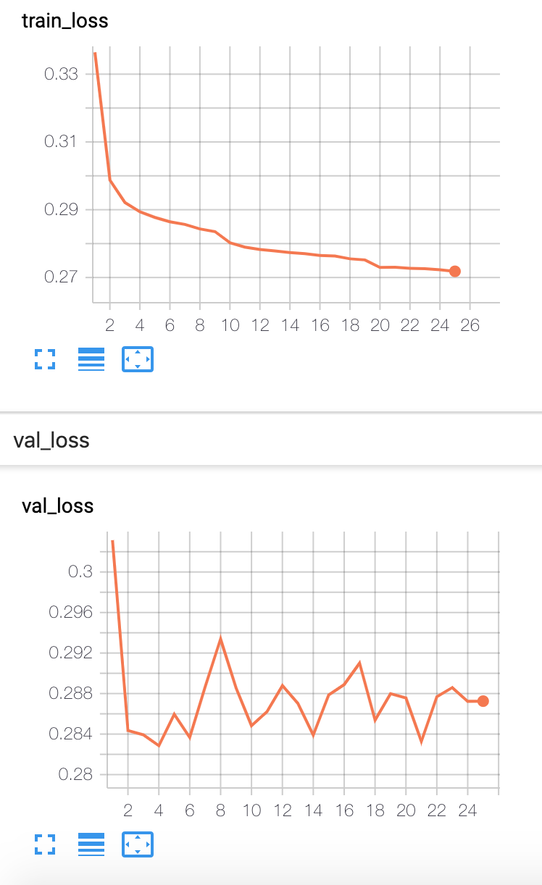

# Beatmap Generator for osu!

Reference Repo: https://github.com/kotritrona/osumapper

Data: https://pan.baidu.com/s/1xqTLtfbMd7DMc1sWZxGCBw

.osu Format: https://osu.ppy.sh/help/wiki/osu!_File_Formats/Osu_(file_format)

Video for Generated Beatmap: https://drive.google.com/file/d/1N71juERfY-CZtFXWFYUWlTLsuG3EGOxQ/view?usp=sharing

Currently only using: Standard -> Beatmap Pack -> 800-899

## Data structure                       
- "lst" (transformed data): table of [TICK, TIME, NOTE, IS_CIRCLE, IS_SLIDER, IS_SPINNER, IS_SLIDER_END, IS_SPINNER_END, SLIDING, SPINNING, MOMENTUM, ANGULAR_MOMENTUM, EX1, EX2, EX3], length MAPTICKS
- "wav" (wav data): np.array, shape of [len(snapsize), MAPTICKS, 2, fft_size//4]
- "flow" (flow data): table of [TICK, TIME, TYPE, X, Y, IN_DX, IN_DY, OUT_DX, OUT_DY] notes only

### About MOMENTUM & ANGULAR_MOMENTUM
Two new variables defined by that author to capture the information about the moving speed of the mouse.
Probably they are not necessary.

## DONE:
1. Beatmap resources
2. Create maplist: maplist_Normal.txt, maplist_Hard.txt, maplist_Easy.txt
3. use osureader.py to parse the beatmap
4. save data to .npz files (one for each): transformed_data, wav_data, flow_data
5. CRNN, (model1 and model2)

6. GAN

## TODO:

Sorry for bringing up such a big project...Let's see where we can get.

### Data Preparation
1. think more about the input and output

### Network Architecture (generate the 'transformed' data)
1. model1: almost no circles; deal with unbalanced training data
2. replace div data with something built with madmom downbeat tracking...

### GAN (generate the 'flow' data)
1. write into python script
2. replace with my model (See predict_CRNN.py and notebook 6)

### Evaluation Metrics
1. F-score (That's why we need to deal with the unbalanced issue)

## Deliverables
- Report
- Demo Video: Generate with one click -> Play:)

